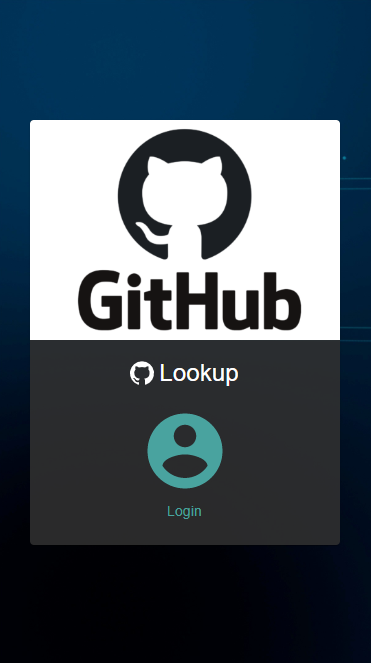

# Github-lookup

Here is a little app to experiment with redux sagas.
The concept is to use github api to look for similar code and help developers find better approaches discovered by their peers.

## Stack

Typescript is used for the entire codebase.

### Front

- Libray : React (bootstrapped with Create React App)
- Store : Redux
- Managing state side effects : Redux sagas
- Communication with the backend : axios
- UI Framework : Material UI

### Backend

- Framework : Express
- Communication with github api : axios
- security : json web tokens

## Demo

